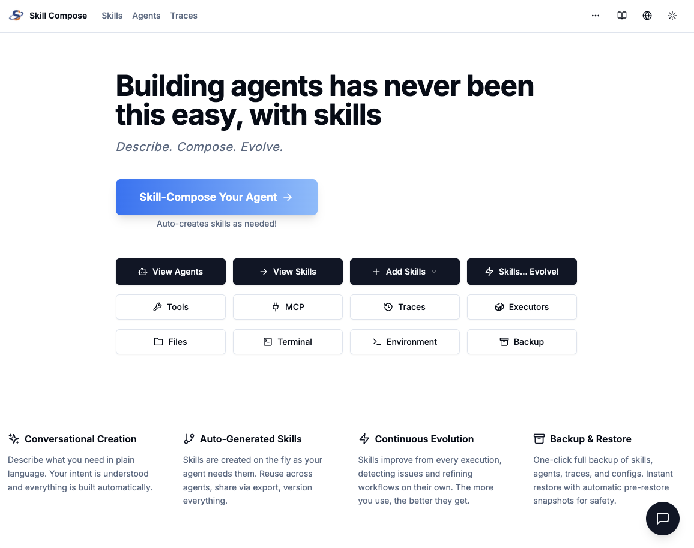
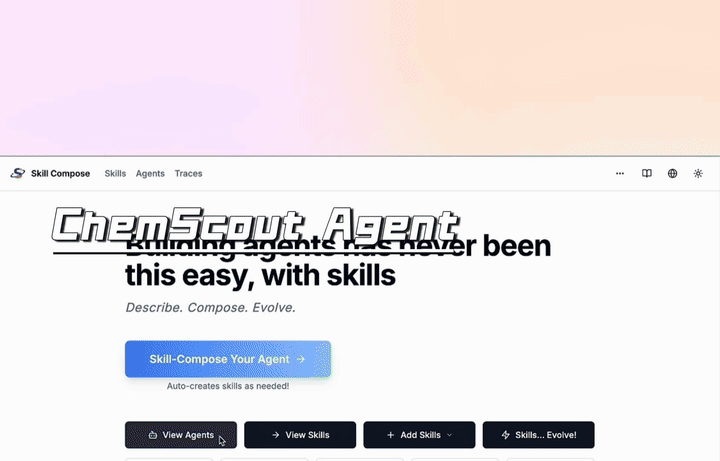

<p align="center">
  
</p>

<p align="center">
  <a href="./README.md"></a>
  <a href="./README_es.md"></a>
  <a href="./README_pt-BR.md"></a>
  <a href="./README_zh-CN.md"></a>
  <a href="./README_ja.md"></a>
</p>

<p align="center">
Skill Compose は、スキル駆動型エージェントのためのオープンソースのエージェントビルダー＆ランタイムプラットフォームです。<br>
ワークフローグラフ不要。CLI 不要。
</p>

<p align="center">
  <a href="LICENSE"></a>
  <a href="https://www.python.org/"></a>
  <a href="https://nextjs.org/"></a>
  <a href="https://discord.gg/uRDx9hJj"></a>
  <a href="https://x.com/SkillComposeAI/"></a>
</p>

<p align="center">
  
</p>

## 主な機能

- 🧩 **スキルをファーストクラスの成果物として** — バージョン管理・レビュー可能なスキルパッケージ（コントラクト、参考資料、ルーブリック、ヘルパー）。脆いグラフではありません。
- 🧠 **「Skill-Compose My Agent」ワークフロー** — 必要なものを記述するだけで、Skill Compose がスキルを検索・再利用し、不足分を起草してエージェントを構成します。
- 🔌 **ツール + MCP 接続** — グルーコードを手書きせずにツールや MCP サーバーを接続。
- 🚀 **ワンクリック公開** — **Web チャット**（共有リンク）や **API**（統合用エンドポイント）としてワンクリックでデプロイ。
- 🛡️ **コンテナファーストの分離** — コンテナ（または K8s Pod）でエージェントを実行し、ホストをクリーンに保ち、再現性のある実行を実現。
- 🧱 **ヘビー環境向け Executor** — エージェントごとにカスタム Docker イメージ / K8s ランタイムを割り当て（GPU/ML/HPC スタック、カスタムビルド）。
- 📦 **スキルライフサイクル管理** — GitHub インポート + ワンクリック更新、マルチフォーマットのインポート/エクスポート、バージョン履歴、差分/ロールバック、ローカル同期。
- 🔄 **実行結果に基づくスキル進化** — フィードバックと実行トレースを活用してスキルを改善。提案された書き換えをレビュー可能。
- 🗂️ **スキルライブラリの整理** — カテゴリ、ピン留め、軽量な検索機能で 100 以上のスキルを効率的に管理。

## 使用例

<table>
<tr>
<td align="center">
<b>Skill-Compose でエージェントを構築</b><br>
<sub>必要なものを記述するだけで、Skill Compose がエージェントを構築します — 既存スキルの検索、不足スキルの起草、すべての接続を自動で行います。</sub><br><br>

</td>
</tr>
<tr>
<td align="center">
<b>エージェントを進化させる</b><br>
<sub>実行トレースとユーザーフィードバックからスキルを自動改善。提案された変更をレビューし、書き換えを承認して、エージェントとスキルがよりスマートになるのを実感してください。</sub><br><br>

</td>
</tr>
<tr>
<td align="center">
<b>デモエージェント：記事からスライドへ</b><br>
<sub>あらゆる記事や論文を洗練されたスライドに変換。エージェントがコンテンツを読み取り、キーポイントを抽出、ストーリーボードを起草し、プレゼンテーション用スライドを生成します。</sub><br><br>

</td>
</tr>
<tr>
<td align="center">
<b>デモエージェント：ChemScout</b><br>
<sub>隔離された実行環境で動作！化合物データベースの検索、分子構造の分析、調査結果の構造化レポートへの要約を行う化学研究アシスタントです。</sub><br><br>

</td>
</tr>
</table>

## アーキテクチャ

<p align="center">
  
</p>

*表示されている一部の機能はまだ開発中の場合があります。*

## クイックスタート

Docker で始めましょう：

```bash
git clone https://github.com/MooseGoose0701/skill-compose.git
cd skill-compose/docker
# デフォルトモデルは Kimi 2.5（API キー：MOONSHOT_API_KEY）です。少なくとも1つの LLM API キーを追加してください。
# 起動後、Web UI の「Environment」ページで API キーを手動設定することもできます。
cp .env.example .env
docker compose up -d
```

**http://localhost:62600** を開き、**「Skill-Compose Your Agent」** をクリックしてください。

サービスの停止：

```bash
cd skill-compose/docker
docker compose down
```

<details>
<summary>ソースからビルド（開発者向け）</summary>

```bash
cd skill-compose/docker
cp .env.example .env
# docker-compose.dev.yaml を使用してローカルでイメージをビルド
docker compose -f docker-compose.dev.yaml up -d
# コード変更後、再デプロイ（停止、ビルド、再起動）：
./redeploy.sh          # 全サービス
./redeploy.sh api      # API のみ
./redeploy.sh web      # Web のみ
```

</details>

<details>
<summary>クリーンアップ（初期状態にリセット）</summary>

```bash
cd skill-compose/docker
# '-v' はボリュームに保存されたすべてのデータを削除します
docker compose down -v

# executor プロファイルを起動している場合は、それらも停止してください
docker compose --profile ml --profile gpu down -v
```

</details>

## リソース

- 📚 [完全なドキュメント](docs/) — 入門ガイド、コンセプト、ハウツーガイド、リファレンス
- 🔧 [API リファレンス](docs/docs/reference/api.md) — 完全な REST API エンドポイント
- 🤖 [モデルとプロバイダー](docs/docs/concepts/models.md) — サポートされている LLM と設定

## コントリビューション

バグを発見しましたか？機能のアイデアがありますか？コントリビューション大歓迎です！

## ライセンス

Apache License 2.0 — 詳細は [LICENSE](LICENSE) をご覧ください。
