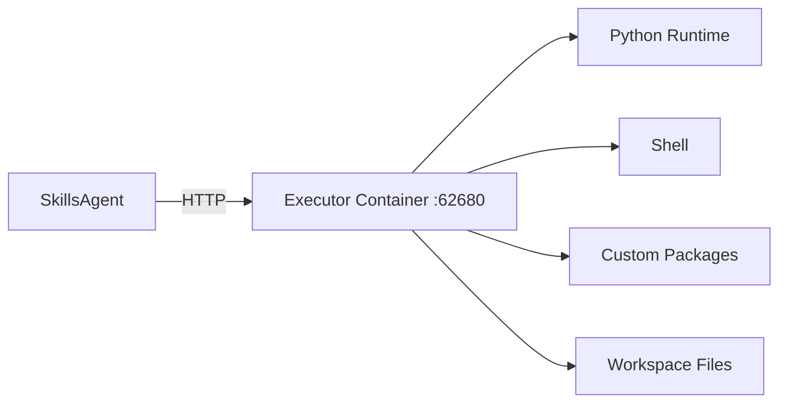

# Executors

An executor is a Docker container that provides an isolated code execution environment. Use executors when your agent needs packages or runtimes beyond the default environment.

## How Executors Work



By default, `execute_code` and `bash` run in the API server's process. When an agent has an executor assigned, those tools route to the executor container via HTTP instead.

Both local and remote execution use a persistent IPython kernel per workspace, so variables, imports, and state persist across `execute_code` calls. The kernel starts lazily on first use and falls back to subprocess if unavailable. The kernel's working directory is explicitly set via `os.chdir()` after startup to ensure files are written to the correct workspace.

Each executor container runs a FastAPI service (`executor_server.py`) on port 62680 with these endpoints:
- `POST /execute/python` — run Python code (via persistent kernel, subprocess fallback)
- `POST /execute/bash` — run shell commands
- `POST /kernel/shutdown` — shutdown a workspace's kernel

## Built-in Executors

| Executor | Description | Key Packages | Docker Profile |
|----------|-------------|-------------|----------------|
| **base** | Basic Python environment | requests, httpx, pillow, beautifulsoup4 | Default (always started) |
| **ml** | Machine learning | pandas, sklearn, torch, transformers | `ml` |
| **cuda** | GPU acceleration | CUDA 12.1, PyTorch GPU | `gpu` |
| **data-analysis** | Data analysis | numpy, pandas, matplotlib, seaborn, scikit-learn | `data-analysis` |

Start executors via Docker Compose profiles:

```bash
docker compose --profile ml up -d        # Start ML executor
docker compose --profile gpu up -d       # Start GPU executor
docker compose --profile data-analysis up -d  # Start data-analysis executor
```

## Assigning an Executor

### In the Chat Panel

The chat panel and fullscreen chat page (`/chat`) include an **Executor** dropdown that appears when online executors are detected:

1. Open the chat panel or go to `/chat`
2. Select an executor from the **Executor** dropdown (between Model and Settings)
3. Choose **Local** (default, runs in API subprocess) or any online executor

Selecting an agent preset auto-applies the preset's executor. Manually changing the executor clears the preset selection.

### In Agent Configuration

1. Go to **Agents** > select an agent
2. Choose an executor from the **Executor** dropdown
3. Save

When a preset with an executor is used (including published agents), code execution routes to that executor automatically.

### Via API

In custom mode (no `agent_id`), pass `executor_id` directly:

```bash
curl -X POST http://localhost:62610/api/v1/agent/run/stream \
  -H "Content-Type: application/json" \
  -d '{
    "request": "Analyze this CSV with pandas",
    "executor_id": "executor-uuid-here"
  }'
```

When using a preset (`agent_id`), the executor is resolved from the preset configuration.

## Custom Executors

Build your own executor when you need specific packages or a specialized runtime. Two approaches:

| Approach | When to Use | Build Speed |
|----------|-------------|-------------|
| **From any base image** | You have an existing large image (CUDA, ML framework) | Slower |
| **Extend skillcompose/executor-base** | You only need extra Python packages | Fast |

See [How to: Build Custom Executor](/how-to/build-custom-executor) for Dockerfiles and step-by-step instructions.

## Health Monitoring

The **Executors** page (`/executors`) shows the status of each executor:

| Status | Meaning |
|--------|---------|
| **Online** | Container is up and healthy (HTTP health check passes) |
| **Offline** | Container is not running or health check fails |

The API discovers executor status via HTTP health checks — no Docker SDK dependency.

## Environment Variables

Environment variables configured on the **Environment** page (or in `.env`) — such as API keys — are automatically forwarded to executor containers at runtime. Skill-specific env vars are also included.

**How it works:**

1. When the agent dispatches `execute_code` or `bash` to an executor, the API reads all user-configured variables from the `.env` file
2. These variables (plus any skill-specific env vars) are sent as the `env` field in the HTTP request to the executor
3. The executor injects them into the kernel (via `os.environ.update()`) or subprocess environment before running user code

This means code running in an executor has the same access to API keys as code running locally — no manual configuration on each executor container is required.

:::tip
If you add a new API key via the Environment page, it becomes available in all executors immediately on the next `execute_code`/`bash` call — no container restart needed.
:::

## Workspace Isolation

Each agent request gets a dedicated per-session workspace directory at `/app/workspaces/{workspace_id}`. Code execution (`execute_code`, `bash`) uses this directory as the working directory, so files written with relative paths are isolated per request. The workspace volume is shared between the API container and all executor containers via Docker volume mounts, which enables auto-detection of output files.

```
/app/workspaces/
├── {workspace-id-1}/    ← Agent request 1
│   ├── output.csv
│   └── chart.png
├── {workspace-id-2}/    ← Agent request 2
│   └── report.pdf
└── ...
```

Note that `working_dir` (the project root, e.g., `/app`) is separate from `workspace_dir` — file operations like `read`, `write`, `glob`, and `grep` still resolve paths relative to the project root, while code execution runs in the per-session workspace.

### Output File Auto-Detection

After each `execute_code` or `bash` call, the system takes a snapshot of the workspace directory and diffs it against the pre-execution state. New or modified files are automatically reported as `new_files` in the tool result and emitted as `output_file` SSE events, which appear as download links in the chat UI.

## Related

- [Tools](/concepts/tools) — execute_code and bash tools
- [How to: Build Custom Executor](/how-to/build-custom-executor)
