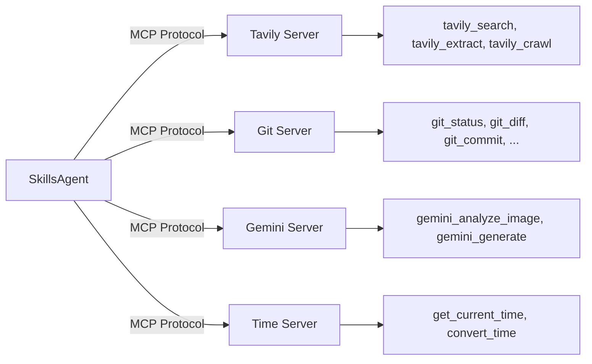

# MCP (Model Context Protocol)

MCP is an open standard for connecting AI models to external services. Skill Compose uses MCP to extend agent capabilities beyond built-in tools — adding web search, Git operations, image analysis, and more.

## How MCP Works



Each MCP server is a separate process that exposes tools via the MCP protocol. The agent discovers available tools at runtime and calls them like built-in tools.

## Tool Auto-Discovery

When you add a new MCP server, Skill Compose can automatically discover its tools by connecting to the server process and querying it via the MCP SDK.

**How it works:**

1. The system spawns the MCP server as a subprocess
2. Connects via stdio and calls `session.list_tools()`
3. Saves discovered tool definitions (name, description, inputSchema) to `config/mcp.json`

**When it triggers:**

- **Automatically** after adding a server via the Web UI
- **Manually** by clicking the refresh (↻) button on any server card in the MCP page

This means you no longer need to manually define tool schemas when adding a server — just provide the command and arguments, and Skill Compose will detect the tools for you.

```bash
# You can also trigger discovery via API
curl -X POST http://localhost:62610/api/v1/mcp/servers/{name}/discover-tools
```

## Available MCP Servers

### Tavily

AI-optimized web search and content extraction.

| Tool | Description |
|------|-------------|
| `tavily_search` | Search the web with AI-enhanced results |
| `tavily_extract` | Extract structured data from URLs |
| `tavily_crawl` | Crawl and analyze websites |

**Requires:** `TAVILY_API_KEY`
**Runtime:** `npx tavily-mcp`

### Time

Timezone utilities.

| Tool | Description |
|------|-------------|
| `get_current_time` | Get current time in any timezone |
| `convert_time` | Convert between timezones |

**Runtime:** `uvx mcp-server-time`

### Git

Version control operations.

| Tool | Description |
|------|-------------|
| `git_status` | Check repository status |
| `git_diff` | View changes |
| `git_log` | View commit history |
| `git_commit` | Create commits |
| `git_add` | Stage files |
| ...and 7 more | Full Git workflow |

**Runtime:** `uvx mcp-server-git`

### Gemini

Google's multimodal AI for image analysis and generation.

| Tool | Description |
|------|-------------|
| `gemini_analyze_image` | Analyze images with vision AI |
| `gemini_generate` | Generate text with Gemini |
| `gemini_generate_image` | Create images |

**Requires:** `GEMINI_API_KEY`
**Runtime:** Local Node.js server (`gemini-mcp-server/`)

## MCP vs Built-in Tools

| Aspect | Built-in Tools | MCP Tools |
|--------|---------------|-----------|
| **Availability** | Always present | Configurable per agent |
| **Latency** | Fastest (in-process) | Slight overhead (subprocess) |
| **Customization** | Fixed set | Add your own servers |
| **Examples** | read, write, execute_code | Tavily, Git, Gemini |

:::tip
`web_fetch` and `web_search` are built-in tools, not MCP. Use them for basic web access without enabling any MCP server.
:::

## Enabling MCP Servers

MCP servers are enabled per agent:

1. Go to **Agents** > select an agent
2. Check the MCP servers you want in the **MCP Servers** section
3. Save

Default agents include **time** and **tavily**.

## Configuration

MCP servers are defined in `config/mcp.json`:

```json
{
  "mcpServers": {
    "tavily": {
      "name": "Tavily Search",
      "description": "AI-powered web search",
      "command": "npx",
      "args": ["tavily-mcp@latest"],
      "env": {
        "TAVILY_API_KEY": "${TAVILY_API_KEY}"
      },
      "defaultEnabled": false,
      "tools": [...]
    }
  }
}
```

Environment variables use `${VAR_NAME}` syntax and resolve from your `.env` file.

## Creating Custom MCP Servers

Two approaches:

1. **Ask the agent** — use the mcp-builder skill: *"Create an MCP server that queries my PostgreSQL database"*
2. **Manual** — add an entry to `config/mcp.json` and implement the server

See [How to: Configure MCP](/how-to/configure-mcp) for step-by-step instructions.

## Related

- [Tools](/concepts/tools) — Built-in tool reference
- [Agents](/concepts/agents) — MCP configuration in agents
- [How to: Configure MCP](/how-to/configure-mcp)
