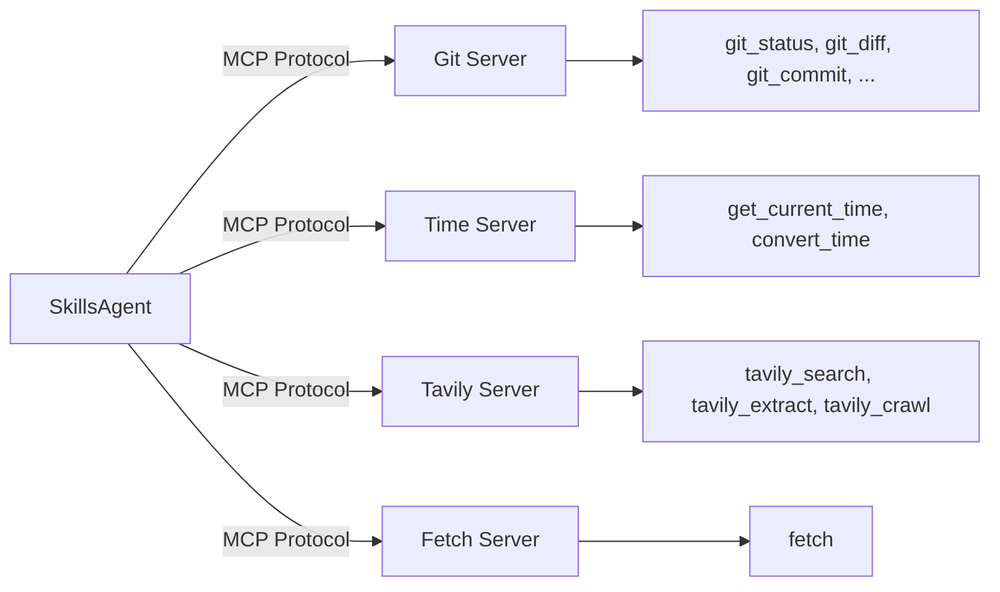

# MCP (Model Context Protocol)

MCP is an open standard for connecting AI models to external services. Skill Compose uses MCP to extend agent capabilities beyond built-in tools — adding web search, Git operations, URL fetching, and more.

## How MCP Works



Each MCP server runs as a separate subprocess that exposes tools via the MCP protocol. The agent discovers available tools at runtime and calls them like built-in tools.

## Adding an MCP Server

Click **Add Server** on the MCP page, then paste the JSON configuration from any MCP server's README:

```json
{
  "server-name": {
    "command": "npx",
    "args": ["package-name"]
  }
}
```

The dialog accepts the standard MCP JSON format. If the config is wrapped in `"mcpServers": { ... }` (common in READMEs), it will be auto-unwrapped.

After adding, Skill Compose automatically starts the server process, discovers its tools, and makes them available to agents — no manual schema definitions needed.

## Tool Auto-Discovery

When you add a new MCP server, Skill Compose automatically discovers its tools by connecting to the server process and querying it via the MCP SDK.

**How it works:**

1. Spawns the MCP server as a subprocess
2. Connects via stdio and calls `session.list_tools()`
3. Saves discovered tool definitions (name, description, inputSchema) to `config/mcp.json`

**When it triggers:**

- **Automatically** after adding a server via the Web UI (fire-and-forget)
- **Manually** by clicking the refresh button on any server card
- **Via API:** `POST /api/v1/mcp/servers/{name}/discover-tools`

## API Key Management

Some MCP servers require API keys (e.g. Tavily). The MCP page shows the status of each required key:

- **Configured** — key is set and ready to use
- **From ENV** — key is resolved from your `.env` file
- **Not Set** — key needs to be configured

Click on a key to set or update its value directly from the UI. Keys are saved to `.env` and take effect immediately.

## Default Servers

These servers are enabled by default and available out of the box:

### Git

Version control operations via `uvx mcp-server-git`.

| Tool | Description |
|------|-------------|
| `git_status` | Check repository status |
| `git_diff_unstaged` | View unstaged changes |
| `git_diff_staged` | View staged changes |
| `git_diff` | Compare branches or commits |
| `git_commit` | Create commits |
| `git_add` | Stage files |
| `git_reset` | Unstage changes |
| `git_log` | View commit history (with date filtering) |
| `git_create_branch` | Create a new branch |
| `git_checkout` | Switch branches |
| `git_show` | Show commit contents |
| `git_branch` | List branches (local/remote/all) |

### Time

Timezone utilities via `uvx mcp-server-time`.

| Tool | Description |
|------|-------------|
| `get_current_time` | Get current time in any IANA timezone |
| `convert_time` | Convert between timezones |

### Tavily

AI-optimized web search and content extraction via `npx tavily-mcp`.

| Tool | Description |
|------|-------------|
| `tavily_search` | Search the web with customizable depth and domain filtering |
| `tavily_extract` | Extract and process content from URLs |
| `tavily_crawl` | Crawl websites with configurable depth and page limits |

**Requires:** `TAVILY_API_KEY`

### Fetch

URL fetching and content extraction via `uvx mcp-server-fetch`.

| Tool | Description |
|------|-------------|
| `fetch` | Fetch a URL and extract its contents as markdown |

## MCP vs Built-in Tools

| Aspect | Built-in Tools | MCP Tools |
|--------|---------------|-----------|
| **Availability** | Always present | Configurable per agent |
| **Latency** | Fastest (in-process) | Slight overhead (subprocess) |
| **Customization** | Fixed set | Add your own servers |
| **Examples** | read, write, execute_code | Git, Tavily, Fetch |

:::tip
`web_fetch` and `web_search` are built-in tools, not MCP. Use them for basic web access without enabling any MCP server.
:::

## Enabling MCP Servers per Agent

MCP servers are enabled per agent:

1. Go to **Agents** and select an agent
2. Check the MCP servers you want in the **MCP Servers** section
3. Save

Default agents include **git**, **time**, and **tavily**.

## Configuration File

MCP servers are defined in `config/mcp.json`:

```json
{
  "mcpServers": {
    "tavily": {
      "name": "Tavily Search",
      "description": "AI-optimized web search and content extraction",
      "command": "npx",
      "args": ["-y", "tavily-mcp@latest"],
      "env": {
        "TAVILY_API_KEY": "${TAVILY_API_KEY}"
      },
      "defaultEnabled": true,
      "tools": [...]
    }
  }
}
```

Environment variables use `${VAR_NAME}` syntax and resolve from your `.env` file. Multi-worker deployments stay in sync — `get_mcp_client()` detects `mcp.json` file changes and auto-reloads.

## Creating Custom MCP Servers

Two approaches:

1. **Ask the agent** — use the `mcp-builder` skill: *"Create an MCP server that queries my PostgreSQL database"*. The agent will scaffold the code, build it, and register it to `config/mcp.json` automatically.
2. **Paste from README** — find any MCP server on npm/PyPI, copy its JSON config, and paste it into the Add Server dialog.

## Related

- [Tools](/concepts/tools) — Built-in tool reference
- [Agents](/concepts/agents) — MCP configuration in agents
- [How to: Configure MCP](/how-to/configure-mcp)
