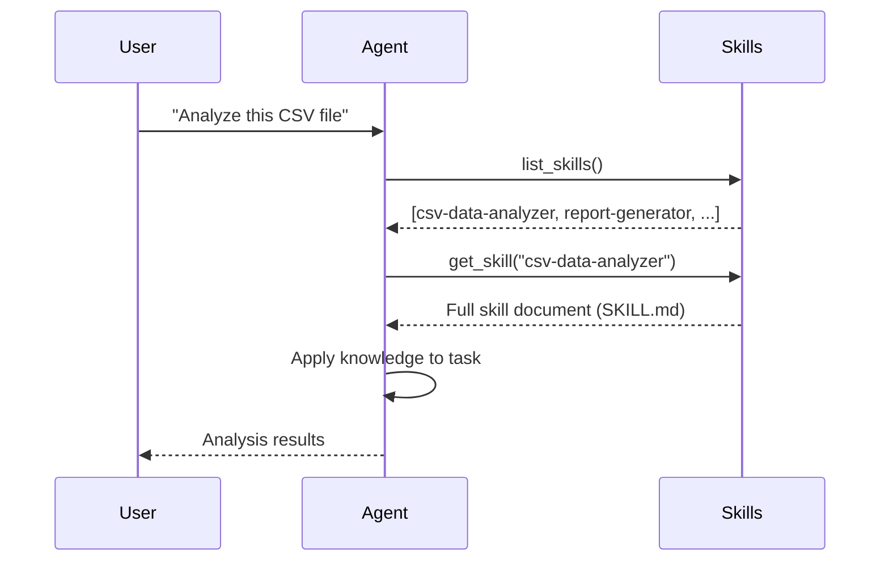
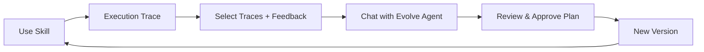

# Skills

A skill is a structured knowledge document that teaches an agent how to perform a specific task. Unlike tools (which provide executable actions), skills provide domain expertise — instructions, best practices, and examples.

## Skills vs Tools

| Aspect | Skill | Tool |
|--------|-------|------|
| **Provides** | Knowledge | Actions |
| **Contains** | Instructions, examples, best practices | Executable functions |
| **Example** | "How to analyze CSV data" | `execute_code()`, `read()` |
| **Created by** | You or the agent-builder | Built into the system |
| **Reusable** | Across any number of agents | Fixed functionality |

Skills tell the agent *how* to do things. Tools let the agent *actually* do them.

## How Agents Use Skills



The agent decides which skills are relevant based on the user's request. The `skills_used` field in execution traces records which skills were actually retrieved (not just available).

## Skill Structure

A skill lives in a directory under `skills/`:

```
my-skill/
├── SKILL.md           # Main document (required)
├── scripts/           # Helper scripts (optional)
│   └── process.py
├── references/        # Reference materials (optional)
│   └── spec.pdf
└── assets/            # Images, data files (optional)
    └── template.csv
```

See [Reference: SKILL.md Format](/reference/skill-format) for the complete specification.

## Skill Types

| Type | Description | Editable | Visible in Chat |
|------|-------------|----------|-----------------|
| **User Skills** | Created by you or the agent-builder | Yes | Yes |
| **Meta Skills** | System skills (skill-creator, skill-evolver, skill-updater, mcp-builder) | No | No |

Meta skills are pinned to the top of the skills list page. Only user skills appear in the chat panel's skill selector.

## Versioning

Every change to a skill creates a new version:

- Version numbers auto-increment (0.0.1 → 0.0.2 → 0.0.3)
- Full content is preserved for each version
- You can view diffs between any two versions
- Switch to any historical version (creates a new version with the old content)

The **Versions** tab on the skill detail page shows the complete timeline.

## Skill Evolution

Skills improve over time through an interactive, chat-based evolution flow:



The **Evolve** page provides a conversational interface where the `skill-evolve-helper` agent analyzes traces, proposes a plan, and waits for your confirmation before applying changes.

Evolution sources:

| Source | What It Uses | Best For |
|--------|-------------|----------|
| **Traces** | Execution history (failures, high tokens, misuse) | Data-driven improvements |
| **Feedback** | Your specific guidance | Feature additions, targeted fixes |
| **Combined** | Both traces and feedback | Comprehensive improvement |

See [How to: Evolve Skills](/how-to/evolve-skills) for the full workflow.

## Filesystem Sync

When you open a skill's detail page (or switch tabs), the system compares disk files against the database. If they differ — for example, if you edited `SKILL.md` directly — a new version is created automatically and a dialog notifies you.

:::info
Skills without a disk directory (imported via database only) and skills without any versions skip the sync check.
:::

## Creating Skills

### Automatic

Ask the agent-builder in chat:

```
Create a skill for converting HTML tables to clean CSV format
```

### Manual

Create a `SKILL.md` file in `skills/your-skill-name/`. The system imports it automatically on startup, or you can trigger import from the Skills page.

### Via UI

Go to **Skills** > **New** and fill in the skill details.

See [How to: Create a Skill](/how-to/create-skill) for detailed instructions.

## Related

- [How to: Create a Skill](/how-to/create-skill)
- [How to: Evolve Skills](/how-to/evolve-skills)
- [How to: Import & Export Skills](/how-to/import-export-skills)
- [Reference: SKILL.md Format](/reference/skill-format)
