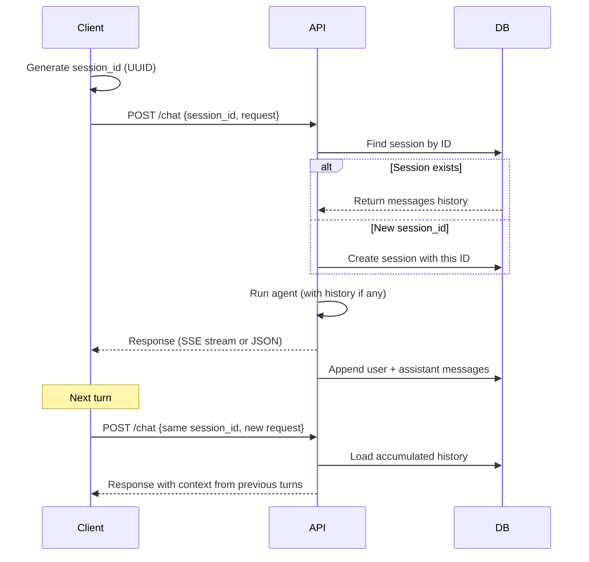

# Publish an Agent

Publish an agent to create a public chat endpoint that anyone can use — either as a web page or via API.

## Prerequisites

- An existing [agent](/how-to/create-agent)
- Skill Compose running and accessible

## Publish

1. Go to **Agents** > select an agent
2. Click **Publish**
3. Choose a **response mode**:
   - **Streaming** — real-time SSE stream, ideal for web UIs (`/chat` endpoint)
   - **Non-Streaming** — single JSON response, ideal for API integrations (`/chat/sync` endpoint)
4. Copy the generated public URL

The response mode is locked once published. To change mode, unpublish and re-publish.

The web UI URL follows the pattern:

```
http://localhost:62600/published/{agent-id}
```

## How Published Agents Work

Published agents provide a standalone chat interface with the agent's name and description. Users have no access to configuration, skills, or internal settings.

### Response Modes

When publishing, you choose one of two response modes. This determines which API endpoint is available:

| Mode | Endpoint | Response Format | Best For |
|------|----------|----------------|----------|
| `streaming` | `POST /chat` | Server-Sent Events (SSE) | Web UIs, real-time display |
| `non_streaming` | `POST /chat/sync` | Single JSON response | API integrations, scripts |

Calling the wrong endpoint returns a `400` error with a message directing you to the correct one.

### Session Management

Multi-turn conversations are managed via server-side sessions. The `session_id` field in the request controls session behavior:

| Scenario | What Happens |
|----------|-------------|
| `session_id` provided, session exists | Loads conversation history from the session |
| `session_id` provided, session doesn't exist | Creates a new session with that ID |
| `session_id` not provided | Auto-generates a new session ID |

The auto-generated or provided `session_id` is returned in the response so the client can reuse it for subsequent requests.



### Message Persistence

After each turn, the agent's **complete internal messages** — including all intermediate `tool_use` and `tool_result` blocks — are saved to the session. This ensures multi-turn conversations retain full context: skill content retrieved via `get_skill`, code execution results, web search results, and all other tool interactions are preserved across turns.

| Mode | Messages Saved When |
|------|-------------------|
| **Streaming** | Request was not cancelled by the client |
| **Non-Streaming** | Agent completed successfully (`success: true`) |

Session messages use the Anthropic API message format. A single turn that uses tools will produce multiple messages (e.g., `user → assistant[tool_use] → user[tool_result] → assistant[text]`), all of which are stored.

### Chat History (Web UI)

The web UI stores `session_id` in the browser's `sessionStorage`:

- **Refresh** — session preserved, history restored from the API
- **Close tab** — `sessionStorage` cleared, next visit starts a new session
- **New Chat button** — generates a new `session_id`, starting a fresh conversation

## Via Web UI

1. Navigate to the published agent URL: `http://localhost:62600/published/{agent-id}`
2. Type a message and press Enter
3. The agent streams its response in real time
4. Multi-turn context is maintained automatically within the browser tab

## Via API

### Get Agent Info

Retrieve public metadata for a published agent.

```bash
curl http://localhost:62610/api/v1/published/{agent_id}
```

**Response:**

```json
{
  "id": "abc-123",
  "name": "My Agent",
  "description": "A helpful assistant",
  "api_response_mode": "streaming"
}
```

Use the `api_response_mode` field to determine which chat endpoint to call.

### Streaming Chat

For agents published with `streaming` mode. Returns Server-Sent Events (SSE).

```bash
curl -N -X POST http://localhost:62610/api/v1/published/{agent_id}/chat \
  -H "Content-Type: application/json" \
  -d '{"request": "Hello", "session_id": "my-session-001"}'
```

**SSE event types:**

| Event | Description |
|-------|-------------|
| `run_started` | Includes `trace_id` and `session_id` |
| `turn_start` | New agent turn started |
| `text_delta` | Incremental text chunk from LLM (token-level streaming) |
| `tool_call` | Tool call started |
| `tool_result` | Tool call result |
| `output_file` | Auto-detected output file |
| `complete` | Agent finished (contains `answer`, `success`, `total_turns`) |
| `context_compressed` | History was compressed (long conversations) |
| `trace_saved` | Trace record saved to database |
| `error` | Error occurred |

Text arrives incrementally via `text_delta` events as the LLM generates tokens. Accumulate them to build the full response. If the stream connection drops, the system retries automatically.

### Non-Streaming Chat

For agents published with `non_streaming` mode. Returns a single JSON response.

```bash
curl -X POST http://localhost:62610/api/v1/published/{agent_id}/chat/sync \
  -H "Content-Type: application/json" \
  -d '{"request": "Hello", "session_id": "my-session-001"}'
```

**Response:**

```json
{
  "success": true,
  "answer": "Hello! How can I help you today?",
  "total_turns": 1,
  "steps": [
    {
      "role": "assistant",
      "content": "Hello! How can I help you today?",
      "tool_name": null,
      "tool_input": null
    }
  ],
  "error": null,
  "trace_id": "trace-uuid",
  "session_id": "my-session-001"
}
```

### Multi-turn Conversation

Reuse the same `session_id` across requests to maintain conversation context:

```bash
SESSION_ID="my-session-$(uuidgen)"

# Turn 1
curl -X POST http://localhost:62610/api/v1/published/{agent_id}/chat/sync \
  -H "Content-Type: application/json" \
  -d "{\"request\": \"My name is Alice\", \"session_id\": \"$SESSION_ID\"}"

# Turn 2 — the agent remembers the previous turn
curl -X POST http://localhost:62610/api/v1/published/{agent_id}/chat/sync \
  -H "Content-Type: application/json" \
  -d "{\"request\": \"What is my name?\", \"session_id\": \"$SESSION_ID\"}"
# Response: "Your name is Alice."

# Turn 3
curl -X POST http://localhost:62610/api/v1/published/{agent_id}/chat/sync \
  -H "Content-Type: application/json" \
  -d "{\"request\": \"Summarize our conversation\", \"session_id\": \"$SESSION_ID\"}"
```

### Get Session History

Retrieve the full message history for a session.

```bash
curl http://localhost:62610/api/v1/published/{agent_id}/sessions/{session_id}
```

**Response:**

```json
{
  "session_id": "my-session-001",
  "agent_id": "abc-123",
  "messages": [
    {"role": "user", "content": "List available skills"},
    {"role": "assistant", "content": [{"type": "tool_use", "id": "list_skills:0", "name": "list_skills", "input": {}}]},
    {"role": "user", "content": [{"type": "tool_result", "tool_use_id": "list_skills:0", "content": "{\"skills\": [...], \"count\": 5}"}]},
    {"role": "assistant", "content": [{"type": "text", "text": "Here are 5 available skills: ..."}]},
    {"role": "user", "content": "What is my name?"},
    {"role": "assistant", "content": [{"type": "text", "text": "Your name is Alice."}]}
  ],
  "created_at": "2026-02-07T10:00:00",
  "updated_at": "2026-02-07T10:01:30"
}
```

Messages follow the Anthropic API format. The `content` field can be a plain string (user messages) or an array of content blocks (assistant messages with `text`, `tool_use` blocks; tool result messages with `tool_result` blocks).

### Publish / Unpublish via API

```bash
# Publish with streaming mode
curl -X POST http://localhost:62610/api/v1/agents/{id}/publish \
  -H "Content-Type: application/json" \
  -d '{"api_response_mode": "streaming"}'

# Publish with non-streaming mode
curl -X POST http://localhost:62610/api/v1/agents/{id}/publish \
  -H "Content-Type: application/json" \
  -d '{"api_response_mode": "non_streaming"}'

# Unpublish (resets response mode)
curl -X POST http://localhost:62610/api/v1/agents/{id}/unpublish
```

## Unpublish

1. Go to **Agents** > select the published agent
2. Click **Unpublish**

The public URL immediately stops working. Existing sessions are preserved in the database but become inaccessible. The `api_response_mode` is reset, allowing you to choose a different mode when re-publishing.

## Considerations

- Published agents use your LLM API key — monitor usage
- The agent configuration (model, tools, skills, executor) is fixed at the time of publishing
- Sessions are stored in the `published_sessions` database table as JSONB
- Published agents include full tool access as configured — review the agent's tools before publishing
- Each chat request creates a trace record, viewable on the Traces page
- The response mode cannot be changed while published — unpublish first, then re-publish with a different mode
- Long conversations are automatically compressed when approaching the model's context window limit

## Related

- [Create an Agent](/how-to/create-agent) — Agent creation
- [Agents](/concepts/agents) — Agent concepts
- [API Reference — Published Agents](/reference/api#published-agents) — Full endpoint documentation
