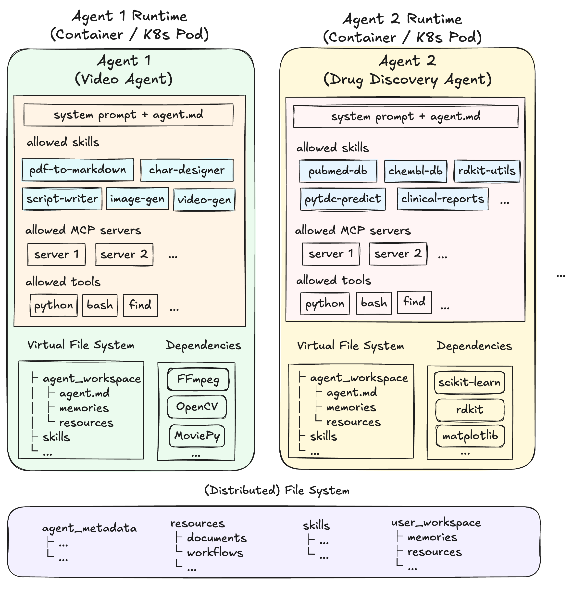

import HomepageFeatures from '@site/src/components/HomepageFeatures';

<div className="hero-banner">
  <h1>Skill Compose</h1>
  <p>
    An open-source agent builder and runtime platform for skill-powered agents.
    <br />
    Describe. Compose. Evolve.
  </p>
</div>

<div className="quick-links">
  <a className="quick-link" href="/quickstart">
    <span className="ql-icon">&#x1F680;</span>
    <span className="ql-title">Quick Start</span>
    <span className="ql-desc">Install and build your first agent in minutes.</span>
  </a>
  <a className="quick-link" href="/concepts/agents">
    <span className="ql-icon">&#x1F4D6;</span>
    <span className="ql-title">Concepts</span>
    <span className="ql-desc">Learn about Skills, Agents, Tools, and MCP.</span>
  </a>
  <a className="quick-link" href="/reference/api">
    <span className="ql-icon">&#x1F4E1;</span>
    <span className="ql-title">API Reference</span>
    <span className="ql-desc">Full REST API documentation and examples.</span>
  </a>
  <a className="quick-link" href="/how-to/create-agent">
    <span className="ql-icon">&#x1F6E0;</span>
    <span className="ql-title">How-To Guides</span>
    <span className="ql-desc">Step-by-step guides for common workflows.</span>
  </a>
</div>

## Why Skill Compose?

Most agent frameworks require you to write code, configure tools, and manually define and wire workflows. Skill Compose takes a different approach: you describe your intent in plain language, and the platform handles the rest.

```
You: "Create an agent that analyzes CSV files and generates reports with charts"

Skill Compose:
  1. Creates a csv-data-analyzer skill
  2. Creates a report-generator skill
  3. Assembles an agent with both skills, code execution, and file export
```

## Key Capabilities

<HomepageFeatures />

## Architecture



*Some features shown may still be in development.*

## Core Concepts

Skill Compose has three types of capabilities that work together:

| Concept | What It Provides | Example |
|---------|-----------------|---------|
| [**Skills**](/concepts/skills) | Domain knowledge — *how* to do things | "PDF to slides", "paper to poster" |
| [**Tools**](/concepts/tools) | Executable actions — *ability* to do things | `python()`, `bash()`, `web_search()` |
| [**MCP**](/concepts/mcp) | External services — *extended* capabilities | Tavily search, Git operations |

An [**Agent**](/concepts/agents) combines these three into a reusable configuration:

## Next Steps

| If you want to... | Read... |
|-------------------|---------|
| Get up and running | [Quick Start](/quickstart) |
| Learn about agents in depth | [Agents](/concepts/agents) |
| Browse the API | [API Reference](/reference/api) |
